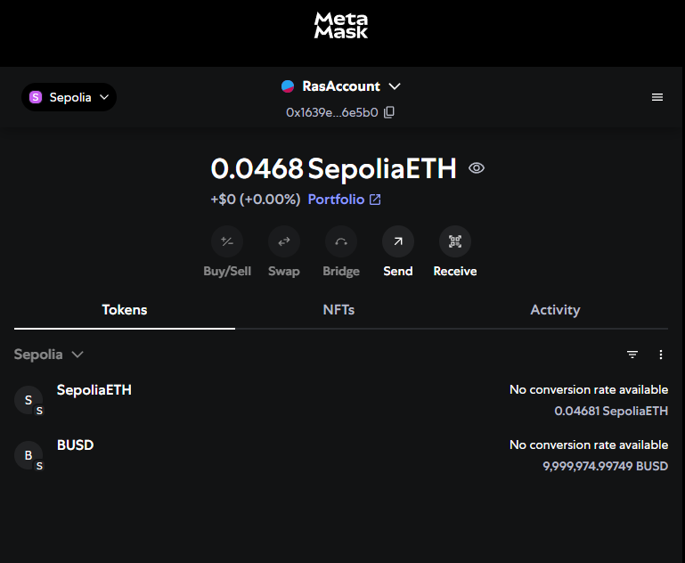
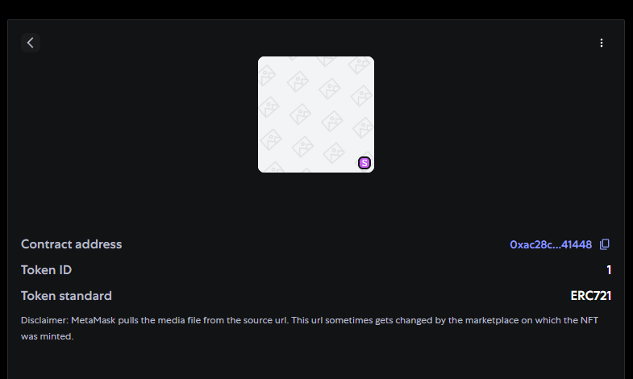
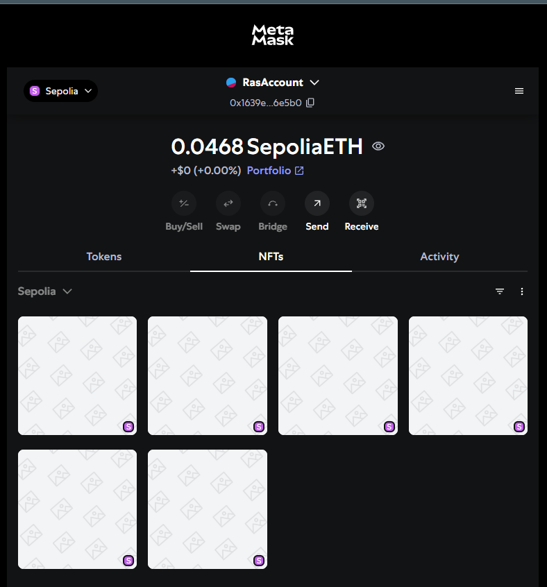
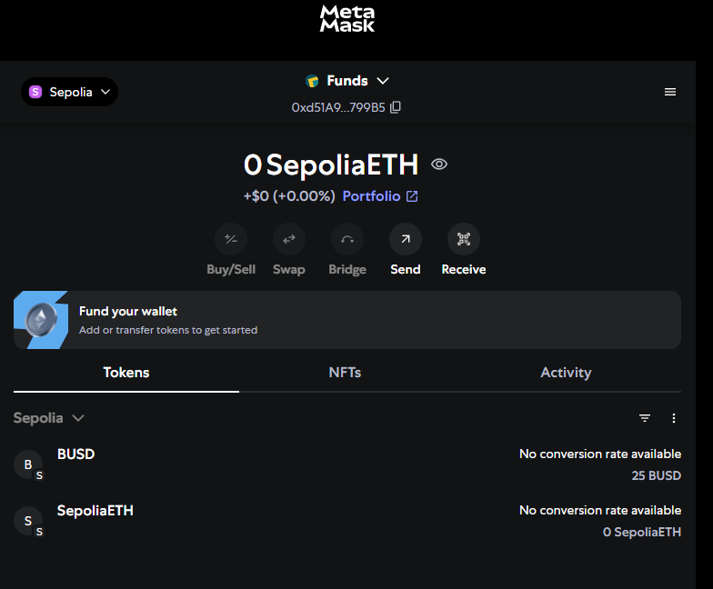
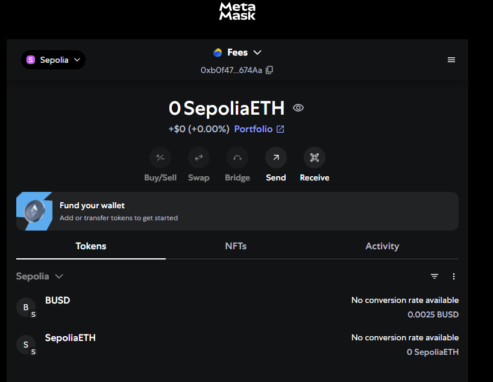
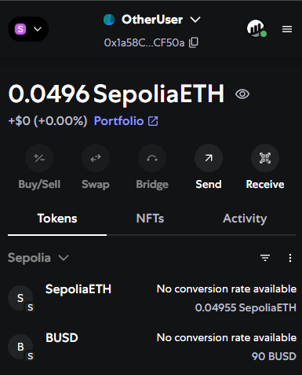
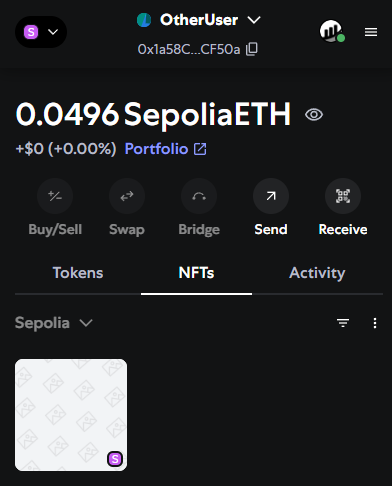

## INDICACIONES - PROYECTO FINAL

### 1- Inicialización de un nuevo proyecto con foundry

Done

### 2- Configuración necesaria del archivo foundry.toml y variables de entorno

Done

### 3- Instalación de contratos de Open Zeppelin

Done

```shell
$ forge install OpenZeppelin/openzeppelin-contracts@v4.5.0 --no-commit
```

### 4- Desarrollo del contrato CCNFT

Done

### 5- Desarrollo del contrato de testeo y scripts de despliegue

Done

### 6- Compilación del proyecto.

Done

### 7- Configuración de archivo Makefile

Done

### 7- Despliegue y verificación de contratos mediante scripts de despliegue/verificación

Done

### 8- Importación de Tokens BUSD (ERC20) en billetera de Metamask mediante dirección del contrato BUSD desplegado.

Done

## 9- Interacción con la funcion "buy"

Done

### Set de todas las funciones que condicionan a la funcion buy

Done

### 10- Aprobacion del contrato CCNFT

Done

```shell
###  Opción posible: Utilizar remix para compilar el contrato BUSD. Una vez compilado, en la pestañña de Despliegue:
$ Agregar direccion del contrato "BUSD" para poder interactuar con él: At Address "Direcciṕn del contrato BUSD"
$ approve el contrato CCNFT: spender: "Dirección del contrato CCNFT"      value: 10000000000000000000000000 ( el total de _mint(msg.sender, 10000000 * 10 ** 18))
```

### 11- Dentro del contrato CCNFT en Etherscan

Done

```shell
###  seteamos las funciones necesarias (condicionantes) para poder relizar el "buy"
$ SetFeesCollector
$ SetFundsCollector
```

### 12- Ejecución de la funcion buy

Done

## ADJUNTAR EL ENLACE DE SEPOLIA ETHERSCAN DE LA DIRECCION DEL CONTRATO DESPLEGADO JUNTO A TODAS LAS INTERACCIONES REALIZADAS INCLUIDA LA COMPRA DEL NFT (BUY).

Hay una ejecucion previa pero tenia las fees y values muy bajos, queria un ejemplo mas representativo:
https://sepolia.etherscan.io/tx/0x59bb85503e1f4ccfc22d4ca4267b5ac642d73d36ed955a278cd056e021e76faa

## ADJUNTAR UNA CAPTURA DE PANTALLA DEL NFT "CCNFT" Y LOS TOKENS ERC20 "BUSD" IMPORTADOS A METAMASK.

#### Cuenta con los token ERC20



#### Descripcion de un NFT con ID 1



#### Cuenta con los NFT comprados



#### Cuenta collectora de los fondos



#### Cuenta collectora de las fees



## Put on Sale

1. Transferir BUSD a otra
   cuenta https://sepolia.etherscan.io/tx/0x32a5383aed7d01177e632967210d15d04878009ba7a9378b0b12f4af4c291592
2. Poner token 0 en venta https://sepolia.etherscan.io/tx/0x32a5383aed7d01177e632967210d15d04878009ba7a9378b0b12f4af4c291592 
3. Ejecutar trade https://sepolia.etherscan.io/tx/0x05b5d1b6f73cb2db487c5572f7e13d808ccca9d25ddacd2099f9cb0880145677
4. 
4. 
